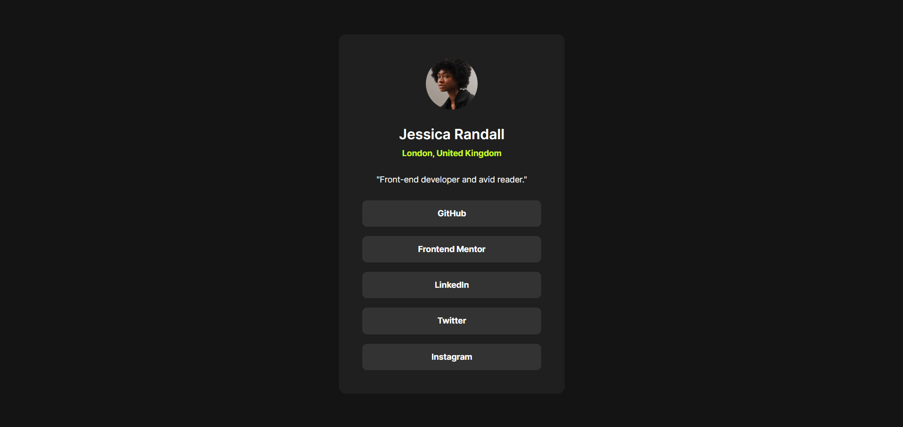

# Frontend Mentor - Social links profile solution

This is a solution to the [Social links profile challenge on Frontend Mentor](https://www.frontendmentor.io/challenges/social-links-profile-UG32l9m6dQ). Frontend Mentor challenges help you improve your coding skills by building realistic projects.

## Table of contents

- [Overview](#overview)
  - [The challenge](#the-challenge)
  - [Screenshot](#screenshot)
  - [Links](#links)
- [My process](#my-process)
  - [Built with](#built-with)
  - [What I learned](#what-i-learned)
  - [Continued development](#continued-development)
  - [Useful resources](#useful-resources)
  - [AI Collaboration](#ai-collaboration)
- [Author](#author)
- [Acknowledgments](#acknowledgments)

## Overview

### The challenge

Users should be able to:

- View the optimal layout for the interface depending on their device's screen size
- See hover and focus states for all interactive elements on the page
- Access the profile information in a clean, card-based layout

### Screenshot



### Links

- Solution URL: [https://github.com/runny-life/social-links-profile](https://github.com/runny-life/social-links-profile)
- Live Site URL: [https://runny-life.github.io/social-links-profile/](https://runny-life.github.io/social-links-profile/)

## My process

### Built with

- Semantic HTML5 markup (`<main>`, `<article>`, `<ul>`, `<h2>`)
- CSS custom properties (variables for colors, fonts, weights)
- Flexbox (for card layout and centering)
- CSS Grid (not used heavily, but available for future expansion)
- Mobile-first workflow
- Fluid typography and spacing with `clamp()`
- BEM-like class naming convention
- Accessible features: `aria-labelledby`, `aria-describedby`, `visually-hidden` class, `:focus-visible`
- Custom fonts loaded via `@font-face` with `font-display: swap`

### What I learned

This project helped reinforce several key concepts in frontend development:

#### 1. **Fluid Layout with `clamp()`**

Using `clamp()` for the card width ensures it adapts smoothly between mobile and desktop without needing multiple breakpoints:

```css
.card {
  width: clamp(20.438rem, 17.038rem + 14.504vw, 24rem);
}
```

This calculates the width based on viewport width, scaling from ~327px on small screens to 384px on larger ones.

#### 2. **Accessibility Best Practices**

I paid special attention to making the component accessible:

- Used `aria-labelledby` and `aria-describedby` to associate the card with its heading and description
- Implemented `:focus-visible` for keyboard navigation (green dashed outline)
- Used a `visually-hidden` class for the main heading that's only visible to screen readers
- Added proper `alt` text for the avatar image

```css
.card__link:focus-visible {
  outline: 2px dashed var(--green);
  outline-offset: 2px;
}
```

#### 3. **Hover State with `@media (hover: hover)`**

To ensure touch devices don't get "stuck" hover states, I wrapped the hover rule in a feature query:

```css
@media (hover: hover) {
  .card__link:hover {
    color: var(--gray-700);
    background-color: var(--green);
  }
}
```

#### 4. **Custom Font Loading**

Using `@font-face` with `font-display: swap` prevents FOIT (Flash of Invisible Text):

```css
@font-face {
  font-family: "Inter";
  src: url("../assets/fonts/static/Inter-Regular.ttf") format("truetype");
  font-weight: 400;
  font-display: swap;
}
```

#### 5. **BEM-like Naming**

I used a consistent naming convention (Block-Element-Modifier style) for maintainability:

```html
<article class="card">
  <div class="card__image-wrapper">...</div>
  <div class="card__info">...</div>
  <ul class="card__list">
    <li class="card__item">
      <a class="card__link">...</a>
    </li>
  </ul>
</article>
```

### Continued development

In future projects, I want to focus on:

- **CSS Grid**: While Flexbox worked well here, I'd like to explore more complex Grid layouts
- **CSS Animation**: Adding subtle micro-interactions (e.g., button press effects, smooth transitions)
- **Accessibility Testing**: Using tools like axe or Lighthouse to audit accessibility scores
- **CSS Custom Properties**: Expanding the use of CSS variables for theming and dark/light mode support
- **Responsive Images**: Using `<picture>` or `srcset` for different screen densities

### Useful resources

- [MDN Web Docs - clamp()](https://developer.mozilla.org/en-US/docs/Web/CSS/clamp) - Helped me understand fluid typography and spacing
- [CSS-Tricks - A Complete Guide to Flexbox](https://css-tricks.com/snippets/css/a-guide-to-flexbox/) - Quick reference for Flexbox properties
- [Frontend Mentor - Accessibility Guide](https://www.frontendmentor.io/accessibility) - Tips for making components accessible
- [W3C - ARIA Authoring Practices](https://www.w3.org/WAI/ARIA/apg/) - For understanding ARIA attributes
- [Google Fonts - Inter](https://fonts.google.com/specimen/Inter) - The font family used in this project

### AI Collaboration

I used AI tools during this project to enhance my workflow and learning:

- **Tool used**: ChatGPT / Claude
- **How I used it**:
  - Providing suggestions for responsive design using `clamp()`
  - Explaining accessibility best practices (ARIA attributes, focus states)
  - Reviewing code for semantic HTML and best practices
  - Helping with the README structure and documentation

## Author

- Frontend Mentor - [@runny-life](https://www.frontendmentor.io/profile/yourusername)
- GitHub - [@runny-life](https://github.com/runny-life)

## Acknowledgments

- **Frontend Mentor** for providing the design challenge and assets
- **The open-source community** for creating tools and resources that make web development accessible to everyone
- **My peers** who provided feedback and encouragement during the learning process
